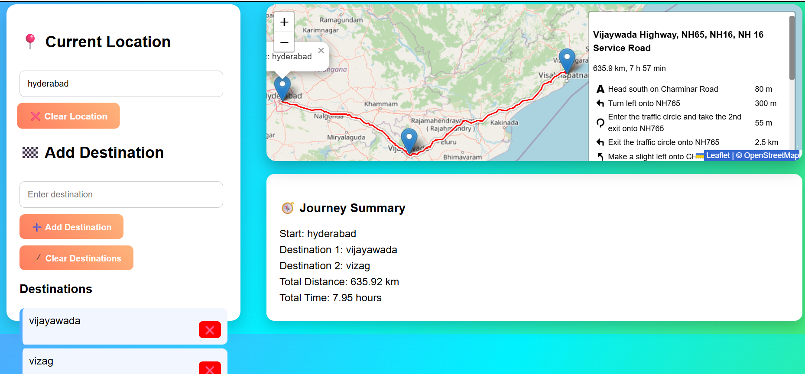

# Smart Travel Planner ✈️

A responsive and interactive **Travel Planner** built with HTML, CSS, and JavaScript using **Leaflet.js** and **Leaflet Routing Machine**.  
Plan your trips by adding your start location and multiple destinations, then view the route on a map with total distance and travel time.

## What This Project Does

- Lets users **enter a start location** and **multiple destinations**.
- Automatically **fetches coordinates** using OpenStreetMap / Nominatim API.
- Draws an **interactive route** on the map connecting all locations.
- Shows a **Journey Summary** with:
  - Start location
  - All destinations
  - Total distance
  - Estimated travel time
- Allows users to **clear or remove destinations**, and **reset the trip**.

## Features

- Interactive map with draggable route markers
- Dynamic journey summary
- Modern gradient UI with clean panels
- Handles location nicknames (e.g., “Vizag” → “Visakhapatnam, India”)
- Alerts for invalid or missing locations

## How to Use

1. Open `index.html` in your browser.
2. Enter your **Start Location**.
3. Add one or more **Destinations**.
4. Click **Show Route** to view your trip on the map.
5. Check the **Journey Summary** for total distance and time.
6. Use **Clear** or **Reset** buttons as needed.

## Technologies Used

- **HTML5 & CSS3** – layout and styling
- **JavaScript (ES6)** – functionality
- **Leaflet.js** – interactive maps
- **Leaflet Routing Machine** – route plotting
- **OpenStreetMap / Nominatim API** – geocoding for coordinates

## Notes

- If a location is not found, the user receives an alert.
- Destinations can be removed individually or cleared all at once.
- Start location can be cleared without affecting destinations.

## License

MIT License
